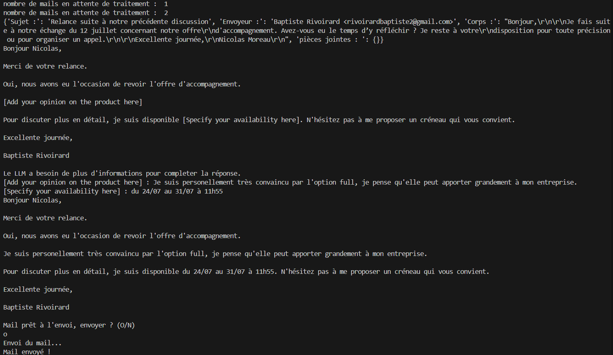

# Projet automatisation email

## But et interet du projet

Ce projet est un répondeur automatique d'email prenant appui sur la compréhension du langage naturel des LLM (large language model) pour fournir des premières versions de mail automatiquement afin de gagner du temps lors des réponses aux mails. L'intérêt personel dans ce projet était de me familiariser avec l'utilisation des concepts important lors de l'utilisation des LLM l'utilisation d'API, le prompt engeneering et autres... 

## Fonctionnement du projet

Ce projet a été codé en python et se compose de quatres scripts principaux :
- **emailrecup.py** contient la fonctions qui permet de se connecter à la boite mail de l'utilisateur via le protocol IMAP et d'y récupperer les messages 'non lu', ainsi que celle qui traite ces mails pour en extraire les informations utiles (sujet du mail, envoyeur, corps du mail, et pièce jointe) et les formater dans un format JSON.

- **llmresponse** contient la fonction qui recoit le JSON d'un mail et qui, via l'API d'openrouter, utilise le modèle Gemma 3n4B de Google pour générer une réponse. Le prompt a été optimisé pour donner un maximum d'information sur le contexte et le format du mail qui lui est fourni ainsi que sur les consignes de ce qu'il doit rendre en retour. Le prompt utilisé permet également au LLM de laisser des placeholders que l'utilisateur peut remplir pour completer ce que le LLM ne peut pas connaitre, par exemple pour indiquer ses disponibilités ou ce que l'utilisateur a pensé d'un produit (le LLM ne pouvant évidement pas connaitre ces informations)

- **emailanswerer.py** contient la fonction pour envoyer automatiquement le mail en utilisant le protocole SMTP. 

- **main.py** est le script principal qui appel les fonctions précedement présentées. Il gère tout de la reception des email à leur envoi une fois traités. Il fonctionne ainsi : Il commence par aller récuperer les mails marqués 'non lu' dans la boite mail puis les traite automatiquement pour en extraire les informations impotantes. Tous les nouveaux emails sont ajouté à une liste puis chaque email de la liste est envoyé au LLM afin qu'il fournisse une première réponse. S'il a laissé des placeholders alors il est demandé à l'utilisateur de completer la phrase avec les informations qu'il est le seul a connaitre. Ensuite la réponse final prête à être envoyé est proposé et si l'utilisateur est satisfait elle est envoyé. Le programme attend ensuite la durée indiqué dans le time.sleep avant de checker pour de nouveaux email.

## Notes 

- Une adresse mail générique Mailo a été utilisé pour le développement de ce projet car il s'agit de l'option la plus simple, les boites gmail ou autres demandant plus d'autorisations afin de pouvoir s'y connecter automatiquement via IMAP. Ainsi il aura surement qelques légères modifications à apporter si on veut l'utiliser pour une boite mail autre que Mailo (cependant la majorité des boites mail acceptent le protocole de connexion IMAP donc le code devrait être facilement adaptable).
- Pour réutiliser le code il faudra également crée sa propre API Key et setup son .env personel.
- De nombreuses pistes d'amélioration sont envisagées par exemple intégrer des fonctionalités de text-to-speach afin que le programme lise les emails recus et les réponses proposées par le LLM, et du speach-to-text pour ajouter oralement les informations de l'utilisateur dans les placeholder afin de completement libérer l'utilisateur pendant sa session de réponse aux mails et qu'il puisse le faire en marchant par exemple. 

## Exemple de fonctionnement

Voici un aperçu de l'exécution dans le terminal :

